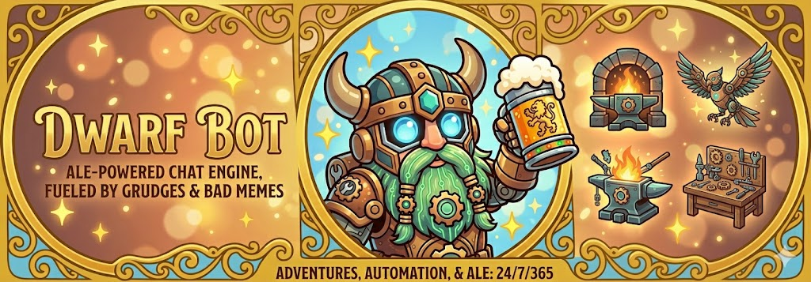

# dwarfbot



[](https://codecov.io/gh/clcollins/dwarfbot) [](https://quay.io/repository/clcollins/dwarfbot)

The cheerful sidekick from
[https://twitch.tv/hammerdwarf](https://twitch.tv/hammerdwarf),
and Co.

## Configuration

DwarfBot supports configuration via CLI flags, environment variables
(`DWARFBOT_` prefix), or a YAML config file (`~/.dwarfbot.yaml`).
At least one platform (Twitch or Discord) must be configured.

Note: Some older documents under `docs/` (for example,
`docs/plan-discord-support.md`) describe legacy configuration keys and
environment variables. Those documents are kept for historical context
only and do not reflect the current configuration interface; the tables
below are the authoritative reference.

### General Settings

| Config Key | CLI Flag | Env Var | Default | Description |
| --- | --- | --- | --- | --- |
| `name` | `--name` / `-n` | `DWARFBOT_NAME` | | Bot display name (used by both platforms) |
| `verbose` | `--verbose` / `-v` | `DWARFBOT_VERBOSE` | `false` | Enable verbose logging |
| `metrics_port` | `--metrics-port` | `DWARFBOT_METRICS_PORT` | `8080` | Port for Prometheus metrics and `/healthz` endpoint |

### Twitch Settings

| Config Key | CLI Flag | Env Var | Default | Description |
| --- | --- | --- | --- | --- |
| `twitch_token` | `--twitch-token` | `DWARFBOT_TWITCH_TOKEN` | | Twitch OAuth token |
| `twitch_channels` | `--twitch-channels` | `DWARFBOT_TWITCH_CHANNELS` | | Twitch channels to join |
| `twitch_server` | `--twitch-server` | `DWARFBOT_TWITCH_SERVER` | `irc.chat.twitch.tv` | Twitch IRC server |
| `twitch_port` | `--twitch-port` | `DWARFBOT_TWITCH_PORT` | `6667` | Twitch IRC port |

### Discord Settings

| Config Key | CLI Flag | Env Var | Default | Description |
| --- | --- | --- | --- | --- |
| `discord_token` | `--discord-token` | `DWARFBOT_DISCORD_TOKEN` | | Discord bot token |
| `discord_channels` | `--discord-channels` | `DWARFBOT_DISCORD_CHANNELS` | | Discord channel IDs to listen in |
| `discord_admin_role` | `--discord-admin-role` | `DWARFBOT_DISCORD_ADMIN_ROLE` | `dwarfbot-admin` | Discord role name for admin commands |

### Example

```sh
# Run with Twitch only
export DWARFBOT_NAME=mybot
export DWARFBOT_TWITCH_TOKEN=oauth:abc123
export DWARFBOT_TWITCH_CHANNELS=mychannel
./dwarfbot

# Run with Discord only
export DWARFBOT_NAME=mybot
export DWARFBOT_DISCORD_TOKEN=Bot_token_here
export DWARFBOT_DISCORD_CHANNELS=123456789
./dwarfbot

# Run with both platforms
export DWARFBOT_NAME=mybot
export DWARFBOT_TWITCH_TOKEN=oauth:abc123
export DWARFBOT_TWITCH_CHANNELS=mychannel
export DWARFBOT_DISCORD_TOKEN=Bot_token_here
export DWARFBOT_DISCORD_CHANNELS=123456789
./dwarfbot
```

## Acknowledgements

1. dwarfbot is (at least in some part) based on work from
   "[Building a Twitch.tv Chat Bot with Go](https://dev.to/foresthoffman/building-a-twitchtv-chat-bot-with-go---part-1-i3k)",
   by [Forest Hoffman](https://github.com/foresthoffman).

## License

MIT License

Copyright (c) 2021 Chris Collins

Permission is hereby granted, free of charge, to any person obtaining a copy
of this software and associated documentation files (the "Software"), to deal
in the Software without restriction, including without limitation the rights
to use, copy, modify, merge, publish, distribute, sublicense, and/or sell
copies of the Software, and to permit persons to whom the Software is
furnished to do so, subject to the following conditions:

The above copyright notice and this permission notice shall be included in all
copies or substantial portions of the Software.

THE SOFTWARE IS PROVIDED "AS IS", WITHOUT WARRANTY OF ANY KIND, EXPRESS OR
IMPLIED, INCLUDING BUT NOT LIMITED TO THE WARRANTIES OF MERCHANTABILITY,
FITNESS FOR A PARTICULAR PURPOSE AND NONINFRINGEMENT. IN NO EVENT SHALL THE
AUTHORS OR COPYRIGHT HOLDERS BE LIABLE FOR ANY CLAIM, DAMAGES OR OTHER
LIABILITY, WHETHER IN AN ACTION OF CONTRACT, TORT OR OTHERWISE, ARISING FROM,
OUT OF OR IN CONNECTION WITH THE SOFTWARE OR THE USE OR OTHER DEALINGS IN THE
SOFTWARE.
